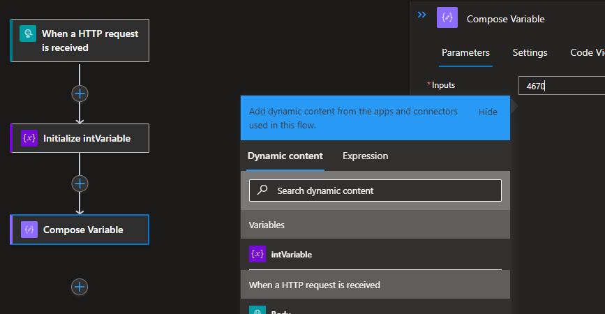
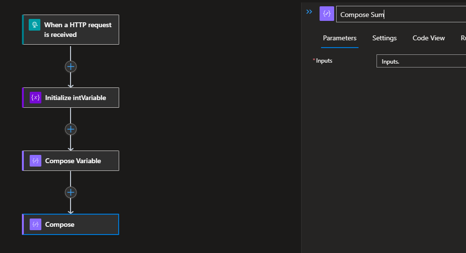
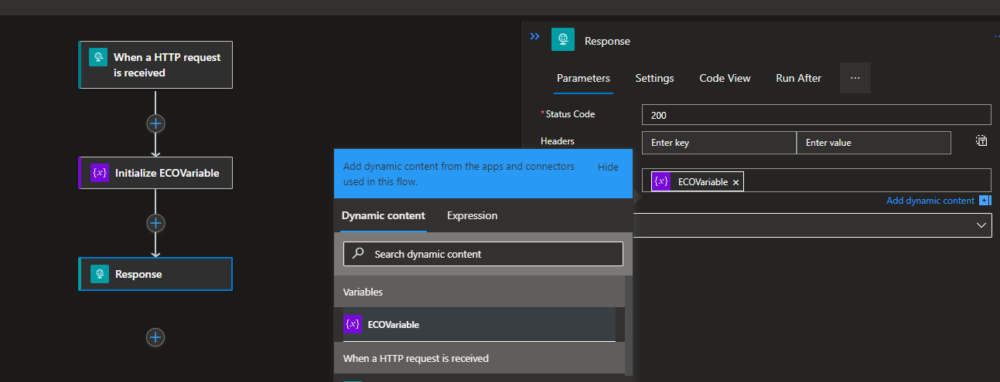

# Hands-On-Labs - Basic Enterprise Integration with Logic Apps. JSON transformation with Parameters
This hands-on lab implements a part of the scenario based on the content described here - [Basic enterprise integration on Azure](https://docs.microsoft.com/en-us/azure/architecture/reference-architectures/enterprise-integration/basic-enterprise-integration)


The scenario above was modified implementing a more complex JSON payload transformation inside of the Logic App instead of doing that in the API Management (APIM) - see green arrows. The complexity is increased by having some parameters needed by the JSON transformation: 


## Scenario overview. Contoso Books, Ltd

Contoso Books, Ltd. is a small but growing company that offers digital purchases of books. They decided to attract new customers through their aggressive and creative advertising strategy and by providing an inventory that is comparable to what the larger online book stores offer. 

They created a new cloud based highly scalable e-commerce portal with the e-Commerce Order (ECO) API exposed to it, and need to integrate ECO API with the existing on-premise order processing system MyBookOrder (MBO) API. The integration is done by JSON transformation using some additional configuration parameters needed by MBO API. 

Since Contoso Books team is consisting of IT professionals and not software engineers, they decided to use Azure Logic Apps for the integration purposes.

Secrets need to be stored in Azure KeyVault

### Contoso Books sample payloads:

[ECO Payload](eco-payload.json)

[MBO Parameters](params.json)

[MBO Payload](mbo-payload.json)

## Setting up your development environment
---
**NOTE**
No Azure Subscription will be needed for this tutorial.

--- 
In this tutorial we will use Visual Studio Code and not the Azure Portal for the development of the Logic Apps. You can run and debug your Logic Apps on your local development machine. 
This became possible after the introduction of the Single-Tenant Logic Apps (Standard) resource type.
The Standard resource type allows you to run many Logic App workflows in one Logic App application. This runtime uses the Azure Functions extensibility model and is hosted as an extension on the Azure Functions runtime. [More information here](https://docs.microsoft.com/en-us/azure/logic-apps/single-tenant-overview-compare#logic-app-standard-resource)   

The Logic App (Standard) resource type contain popular managed connectors available as built-in operations. For example, you can use built-in operations for Azure Service Bus, Azure Event Hubs, SQL, and others. Meanwhile, the managed connector versions are still available and continue to work. Some of these connectors can also be used as emulators for your local development. This tutorial will mostly use the built-in connectors.

Another advantage of using Logic App (Standard) resource type is the ability to create stateless workflows which are more suitable for the real-time operations. This turorial will use stateful workflows for the debugging and testing purposes. Only with this option you will be able to see the execution history of you workflows.  

The complete guide for setting up a local development environment [can be found here](https://docs.microsoft.com/en-us/azure/logic-apps/create-single-tenant-workflows-visual-studio-code)


## Dealing with values in Logic Apps
While many Logic Apps samples deal with simple workflows, dealing with more complex data and Json objects requires a good understanding of dealing with values in your logic apps.

Let's explore Logic Apps [Built-In Actions](https://docs.microsoft.com/en-us/azure/connectors/built-in), [Variables](https://docs.microsoft.com/en-us/azure/logic-apps/logic-apps-create-variables-store-values), [Outputs of Data Operations](https://docs.microsoft.com/en-us/azure/connectors/built-in#manage-or-manipulate-data), Functions and [Expressions](https://docs.microsoft.com/en-us/azure/logic-apps/workflow-definition-language-functions-reference) in a short warm-up excercise.

---
**NOTE**

My Windows machine runs .NET 6 and Azure Functions Core Tools V4, for that reason I use Windows Linux Subsystem (WSL) for the Logic App development where I installed [all necessary tools referred here](https://docs.microsoft.com/en-us/azure/logic-apps/create-single-tenant-workflows-visual-studio-code#tools)  

---

Create your Logic App


Press Crtl-Shift-P to open VS Code Command Palette, search and select "Azure Logic Apps: Create new Project"


Select the folder for your new Logic App:


Select Stateful Workflow


Provide a name for your workflow


After a short while you will see your workflow json file in your VS Code workspace


Open your workflow in designer


Skip usage of Azure Connectors


Search for "HTTP Request" and select the HTTP Request trigger


In this excercise we are not dealing with the HTTP payload. This trigger was just selected to start the workflow processing and explore the values of the variables and outputs.

---
**NOTE**

We recommend you to install the one of the HTTP/REST Client VS Code extensions. We are using the [REST Client](https://marketplace.visualstudio.com/items?itemName=humao.rest-client) extension to trigger the workflow.

--- 

Insert a new action into your workflow


Search for "Intialize variable" action


Create a new Integer variable, give it a name, provide the initial value  and rename the action


Add a new step again. Search for the "Compose" action


Provide it with the value and rename the step



Create a new Compose step and rename it 



Save it 


You will see the red error message an will need to provide the value

Click into "Inputs"


select the Expression tab and type "add"


open a round bracket and you will see the parameters for this function


switch to the Dynamic Content 


select intVariable as the first "add" parameter, add comma and select the Compose Variable outputs


Now you added a function to the outcomes of your second Compose action


If you click into your function, your code looks like this

````

add(variables('intVariable'),outputs('Compose_Variable')) 

````
add a new HTTP Response Action


and add the Outputs of the Compose Sum action to the response body


Save the workflow

Use Ctrl-Shift-P to open the VS Code Command Palette and start Azurite


You will see the Azurite files created emulating some Azure services


Run you Logic App with all the workflows (we have just one)


You will see your Logic App logs here


Now we need to create an HTTP request and trigger the Logic App. But first of all we need to find the endpoint URL of the workflow.

Select the workflow.json file and select Overview


Here you will find the callback URL of your workflow


Create a new file test.http (here we will use the REST Client VS Code extension)


create the following content in this file

````
GET  HTTP/1.1
Content-Type: application/json
````

copy and paste callback between "GET" and "HTTP/1.1"


Now trigger the workflow from the file


You will see the response of the HTTP request with the expected sum we calculated on the right hand side, and below in the Terminal the execution log of the Logic App Azure Functions Extension


Let's inspect the Logic App Run History in the Overview window. You can also close the Response window from the HTTP Request.

Click Refresh to see the latest runs in the Overview window


You will see the latest run here


Open it here


and you will see something like that 


Now you can click into each Action to see the results of the individual action execution


There is one important difference between the variables and the action [output values](https://docs.microsoft.com/en-us/azure/logic-apps/logic-apps-workflow-definition-language#outputs) - you can change the variable value after you initialized it with the [Set Variable action as described here](https://docs.microsoft.com/en-us/azure/logic-apps/logic-apps-create-variables-store-values), but you cannot do it with the output values of the compose action. We often use Compose action to debug a number of variables and output values. 

Please also be aware of the [implicit data type conversions](https://docs.microsoft.com/en-us/azure/logic-apps/workflow-definition-language-functions-reference#implicit-data-type-conversions)  

Additionally, as you improve your Logic App skills, you might decide to work with the [Expression Editor and the workflow.json code, or directly editing the workflow.json file](https://docs.microsoft.com/en-us/azure/logic-apps/logic-apps-workflow-definition-language#expressions) 

## Dealing with Objects and Json data in Logic Apps

Let's create a new workflow from the VS Code Command Palette


Select Stateful Workflow


Give it a name


you will see a new workflow folder in your Logic App project


Open it in the designer and create a simple HTTP Request-Response workflow similar to one we created above and save it


Select your HTTP Request Trigger and click on "use sample payload to generate schema". Your Logic App will create a schema and will be able to parse the HTTP payload into values you can use for the further actions.


add one ECO Order payload as a sample to generate schema 

````
    {
        "orderId": "66e62767-c1cd-46b9-8c9e-f8900a790910",
        "orderDate": "2021-03-19T07:22Z",
        "deliveryAddress": {
            "firstName": "Bob",
            "lastName": "Mustermann",
            "city": "Budapest",
            "country": "Hungary",
            "postalCode": "1073",
            "streetAddress": "Liszt Ferenc tér 5"
        },
        "orderItems": [
            {
                "ISBN": "9783060311354",
                "title": "Fahrenheit 451",
                "author": "Ray Bradbury",
                "category": "sci-fi",
                "price": 11.99,
                "quantity": 1,
                "bookStore": "StoreA",
                "bookStoreBranch": "Budapest"
            },
            {
                "ISBN": "9780571258093",
                "title": "Never let me go",
                "author": "Kazuro Ishiguro",
                "category": "sci-fi",
                "price": 12.99,
                "quantity": 1,
                "bookStore": "StoreB",
                "bookStoreBranch": "Budapest"
            },
            {
                "ISBN": "9780316409131",
                "title": "Upheaval: Turning Points for Nations in Crisis",
                "author": "Jarred Diamond",
                "category": "history",
                "price": 11.99,
                "quantity": 1,
                "bookStore": "StoreA",
                "bookStoreBranch": "Eger"
            }
        ]
    }
````


and press Done button. You will also be notified that our HTTP requests will need to provide 
````
Content-Type: application/json
````

Select the Response Action and for the add the Request Body to the response content


Save your workflow and create another test.http file in your new workflow body. This time we use the HTTP POST method and add the ECO single order payload to it 


Open your workflows overview and grab the callback URL and insert it between POST and HTTP/1.1 tokens in the test.http file


Click on "send request" and see the output of your workflow. You might also decide to explore the run history in the workflow overview.


Now we can start exploring the work with Object and Json data.

Add a new Compose action between the Request trigger and the Response action

Click in Inputs in your new Compose action. Because we provided a sample payload to our trigger you are able to see the parsed tokens from our HTTP payload. 


There is nothing wrong if the parsed HTTP Trigger body satisfies your requerements and you can use it for your Logic App. But what happens if you want to deal with the json variables and action outputs - how do you navigate through the Json object attributes, nested attributes and arrays? What if you are not using HTTP Trigger in your Logic App but receive a Json object you need to deal with?

Let's create a new variable of type Json and assign its value to the value of the HTTP Trigger Body.

You can remove your Compose action if you already saved the workflow and initialize a new variable


Change the response content to this new variable



save it and run your http test - it should return the same result, but now from the variable value


Now we can dissect our Json object derived from the HTTP Trigger body.

---
**NOTE**
You can also create a Json object from the scratch using the  and use it as an output from the Compose action.

---

Add a new Compose action after the Initialize ECOVariable action, switch to the expression editor and type "variables(" it will be autocompleted into "variables()"


type

````
variables('ECOVariable').deliveryAddress)
````
---
**NOTE**
although the expression above will work here, in some cases we might refer to none existing Json attributes and that will cause an exception in your Logic App. For that reason we recommend to use the following notation using the ? operator which will substitute null or not existing values into empty strings

````
variables('ECOVariable')?.deliveryAddress)
````

---

Replace the Response content into output of your Compose action


Run your test again and validate the result


You can also decide and rather [parse your Json object](https://docs.microsoft.com/en-us/azure/logic-apps/logic-apps-perform-data-operations#parse-json-action) and use user-friendly tokens for the Json properties


add the output of the Select Delivery Address action


 
