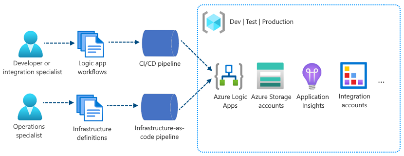
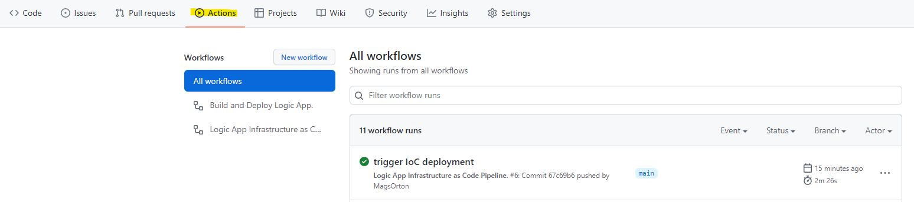

# Hands-On-Labs - Basic Enterprise Integration with Logic Apps. JSON transformation with Parameters

## Logic Apps DevOps with GitHub

The single-tenant model gives you the capability to separate the concerns between app and the underlying infrastructure. Logic app workflows typically have "application code" that you update more often than the underlying infrastructure. By separating these layers, you can focus more on building out your logic app's workflow and spend less on your effort to deploy the required resources across multiple environments.



### GitHub Secrets Setup
Before you can deploy your Logic App infrastructure and workflow code to Azure you need to provide credentials, that  GitHub Actions will use to deploy to your Azure environment.

- Create a Service Principle for your Azure subscription following this [guide](https://github.com/marketplace/actions/azure-login#configure-deployment-credentials)
The output of the ``` az ad sp create-for-rbac --name "{sp-name}" --sdk-auth... ``` command should look like this:
```
{
  "clientId": "<GUID>",
  "clientSecret": "<GUID>",
  "subscriptionId": "<GUID>",
  "tenantId": "<GUID>",
  (...)
}
```
- Save the output of the above command to [GitHub Secrets](https://github.com/marketplace/actions/azure-login#configure-deployment-credentials) and call the secret AZURE_CREDENTIALS
- Create a secret ``` AZURE_SUB ``` with the subscription ID of the subscription you want to deploy to. Subscription IDs can be found using the ``` az account list -o table ``` command.
- Create a secret ``` RG_LA ``` with the resource group name where you want to deploy your Logic App to. 


### Deploying Infrastructure using ARM
The ARM folder contains the ARM templates required to deploy all the required logic app resources.
``` la-template.json ``` file deploys 
- Logic App
- App Service Plan
- Storage Account

After the resources are provisioned, the Application Settions of Logic App will be updated with the storage account connection string for teh newly created storage account.

To deploy this ARM template we need to create a GitHub Action. Workflow files use YAML syntax, and must have either a ``` .yml ``` or ``` .yaml ``` file extension. You must store workflow files in the ``` .github/workflows ``` directory of your repository. 

``` .github/workflows/IaC_deploy.yml ``` is a sample pipeline that will be triggered when either files inside ``` ARM ``` folder get changed or the ``` .github/workflows/IaC_deploy.yml ``` file itself gets changed. The trigger is specified at the very top of the ``` IaC_deploy.yml ``` file.

 ```
on:
  workflow_dispatch:
  push:
    paths:
      - "solution/ARM/**"
      - ".github/workflows/IaC_deploy.yml"
```

To test that the pipeline works you can make a change to the .yml file and navigate to the ``` Actions  ``` tab in your GitHub repository.



Note that if the resource already exists in the resource group and its settings are unchanged, no operation is taken for that resource. If you change the property values for a resource, the resource is updated with those new values. You can read more about Azure Resource Manager deployment modes 
[here](https://docs.microsoft.com/en-us/azure/azure-resource-manager/templates/deployment-modes).

### Deploying Logic Apps Workflow

The pipeline to deploy the Logic Apps workflow will need to build and then deploy the workflow to Azure.
``` .github/workflows/logicapp_deploy.yml ``` is a sample pipeline that will be triggered when IoC pipeline completed of when files inside  the ``` logic ``` folder get changed or the ``` .github/workflows/logicapp_deploy.yml ``` file itself gets changed. The trigger is specified at the very top of the ``` logicapp_deploy.yml ``` file

```
on:
  workflow_dispatch:
    # Trigger the workflow every time the infrastructure build workflow ran to completion
  workflow_run:
    workflows:
      - Logic App Infrastructure as Code Pipeline.
    types:
      - completed
  # Triggers when Logic Apps workflow logic has changed 
  push:
    paths:
      - "logic/**"
      - ".github/workflows/logicapp_deploy.yml"
```

To test that the pipeline works you can make a change to the Logic Apps workflow and navigate to the ``` Actions  ``` tab in your GitHub repository.