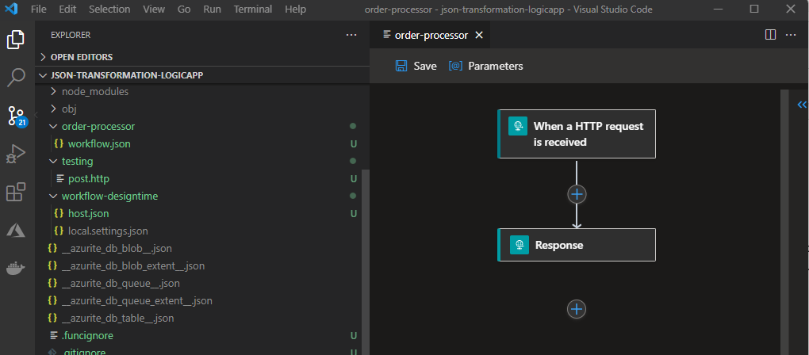

# Create a Logic App Projec. Run, Test and Debug Locally.

In this section we will create a simple Logic App using Visual Studio Code. Our Logic App will be triggered by an HTTP POST request. We will pass a JSON payload in the Body of the request and the Logic App will return an HTTP Response with the same JSON payload that it received.

